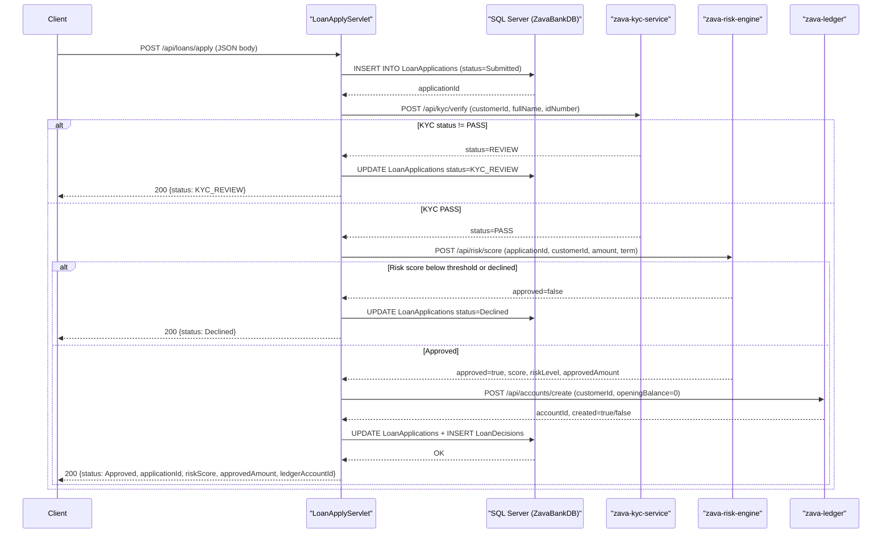

# API & Service Communication Contracts

ZavaLoanOriginationAPI exposes **4 HTTP endpoints** via Jakarta EE Servlets and calls **3 downstream microservices** synchronously over plain HTTP during loan application processing.

## Service Catalog

| Service | Port | Category | Purpose |
|---|---|---|---|
| ZavaLoanOriginationAPI | 8080 (container default) | API Layer / Business | Loan origination WAR; accepts applications, orchestrates KYC, risk, and ledger |
| zava-kyc-service | 8080 | Business | Identity and KYC verification for applicants |
| zava-risk-engine | 8080 | Business | Credit/risk scoring and loan approval decision |
| zava-ledger | 8080 | Business | Creates and manages ledger accounts for approved loans |

## API Endpoints Inventory

| Service | Method | Path | Request Type | Response Type / Status Codes |
|---|---|---|---|---|
| LoanApplyServlet | POST | `/api/loans/apply` | JSON body (customerId, loanProductId, requestedAmount, termMonths, purpose, fullName, idNumber) | 200 JSON (status, applicationId, kycStatus, riskScore, riskLevel, approvedAmount, ledgerAccountCreated, ledgerAccountId); 400 on bad input; 500 on DB error |
| LoanStatusServlet | GET | `/api/loans/{id}/status` | Path parameter: `{id}` (numeric application ID) | 200 JSON (applicationId, status, decisionReason, approvedAmount, interestRate, riskScore, riskLevel); 400 on missing/invalid ID; 404 if not found; 500 on DB error |
| HealthServlet | GET | `/health` | None | 200 HTML (`ZavaLoanOriginationAPI - Online`) |
| LoanBootstrapServlet | — | `/internal/bootstrap` | None (load-on-startup=1; runs at container startup) | N/A — creates DB schema if absent |

## Management & Observability Endpoints

| Service | Endpoint | Custom Metrics |
|---|---|---|
| HealthServlet | `GET /health` | None — returns a plain HTML string; no structured health payload |

> Note: No Spring Boot Actuator, Prometheus endpoint, Swagger/OpenAPI spec, or structured health-check format is present. The `/health` endpoint returns an HTML page rather than a machine-readable response.

## DTOs & Contracts

The application uses **no formal DTO or request/response model classes**. All data marshalling is performed inline using `org.json.JSONObject`:

- **Loan application request**: Fields are read directly from a raw JSON body in `LoanApplyServlet.doPost()`. No validation annotations or dedicated request class exists.
- **Loan application response**: A `JSONObject` is built ad hoc in the servlet and written to the response stream. Fields vary depending on orchestration outcome (KYC review, declined, approved).
- **Loan status response**: Fields are mapped directly from a `ResultSet` into a `JSONObject` in `LoanStatusServlet.doGet()`.
- **Internal orchestration carrier**: `OrchestrationResult` is a private inner class in `LoanApplyServlet` used to pass KYC/risk/ledger outcomes between helper methods. It is not part of the public API surface.
- **Downstream service payloads**: KYC, risk, and ledger requests/responses are also untyped `JSONObject` instances assembled inline.

There is no OpenAPI/Swagger specification, protobuf schema, or GraphQL schema. Serialization is handled entirely by `org.json`.

## Communication Patterns

**Synchronous HTTP (blocking):** All inter-service calls are synchronous, made via `java.net.HttpURLConnection` with a manually crafted `callJsonApi` helper in `LoanApplyServlet`. No HTTP client abstraction (RestTemplate, WebClient, Feign, OkHttp) is used.

**Orchestration flow:** Loan application processing is strictly sequential: KYC → Risk Engine → Ledger. Each step is gated on the previous result — if KYC does not return `PASS`, the risk and ledger calls are skipped and the application status is set to `KYC_REVIEW`. If the risk engine declines, the ledger call is skipped.

**Resilience:** There is **no retry logic, no circuit breaker, no timeout configuration, and no fallback mechanism**. A single network or downstream service failure during `HttpURLConnection.getResponseCode()` will propagate as an uncaught exception and result in a 500 response to the caller.

**Service discovery:** Service base URLs are hardcoded in `loan-origination.properties` (`kyc.service.baseUrl=http://zava-kyc-service:8080`, etc.) or overridden via environment variables. No service registry (Eureka, Consul, Kubernetes DNS) is used programmatically; host resolution relies on the container network.

**Startup dependency chain:** `LoanBootstrapServlet` runs at application startup (`load-on-startup=1`) and creates the `LoanApplications` and `LoanDecisions` tables via raw DDL `IF NOT EXISTS` statements. SQL Server must be reachable at startup; there is no retry or readiness wait.

**Security posture:** There is **no authentication, no authorization, and no TLS configuration** at the application layer. All four endpoints (`/health`, `/api/loans/apply`, `/api/loans/*`, `/internal/bootstrap`) are publicly accessible with no credentials required. Downstream service calls also carry no authentication headers.

## Service Technology Matrix

| Service | Web Framework | Data Access | Discovery | Gateway | Health Check | Cache | Metrics |
|---|---|---|---|---|---|---|---|
| ZavaLoanOriginationAPI | Jakarta EE Servlet 4.0 | Raw JDBC (DriverManager) | None (env var URLs) | None | Custom `/health` (HTML) | None | None |
| zava-kyc-service | Unknown (external) | — | — | — | — | — | — |
| zava-risk-engine | Unknown (external) | — | — | — | — | — | — |
| zava-ledger | Unknown (external) | — | — | — | — | — | — |

## Service Communication Sequence

