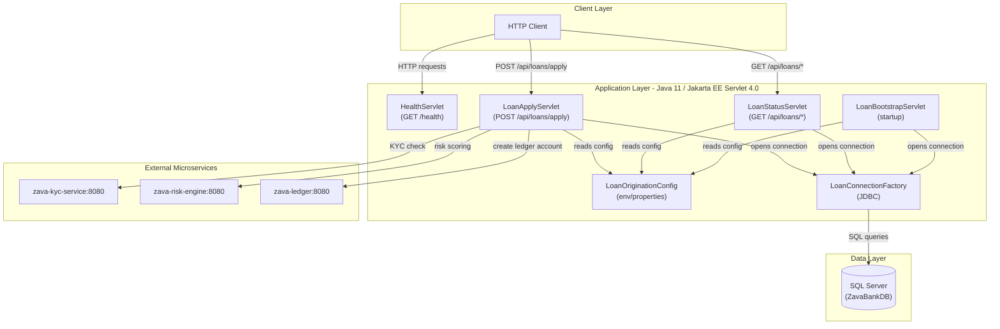
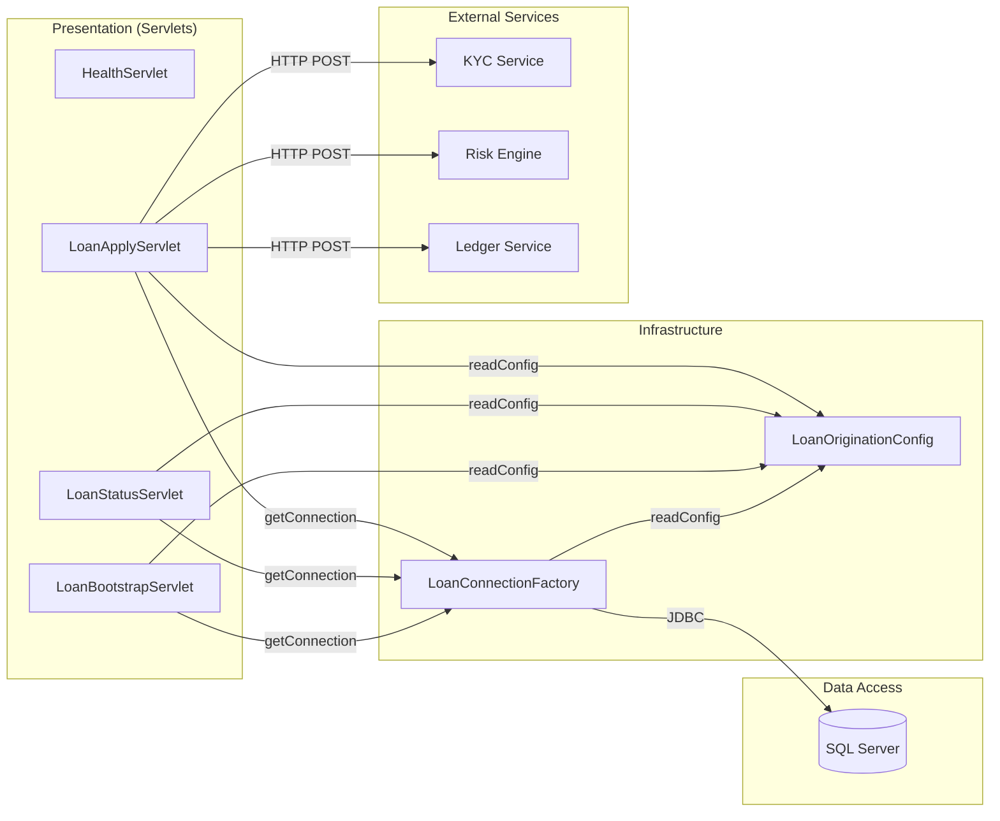

# Architecture Diagram

ZavaLoanOriginationAPI is a Java 11 Jakarta EE servlet-based WAR application that exposes loan origination endpoints backed by Microsoft SQL Server and three internal microservices (KYC, Risk Engine, Ledger).

## Application Architecture

### Technology Stack Summary

| Layer | Technology | Version | Purpose |
|---|---|---|---|
| Servlet Container | Jakarta EE Servlet API | 4.0.1 | HTTP request handling (WAR deployment) |
| Runtime | Java | 11 | Application runtime |
| Build | Gradle | — | Build and WAR packaging |
| Database Driver | Microsoft JDBC for SQL Server | 12.6.3 | JDBC connectivity to SQL Server |
| JSON Processing | org.json | 20140107 | JSON serialization/deserialization |
| Database | Microsoft SQL Server | — | Persistent loan data storage |

### Data Storage & External Services

The application uses a single Microsoft SQL Server database (ZavaBankDB) for all persistent storage, accessed via raw JDBC through `LoanConnectionFactory`. Three internal microservices are called synchronously over HTTP: **zava-kyc-service** performs identity/KYC verification, **zava-risk-engine** computes a risk score and level for a loan application, and **zava-ledger** creates a ledger account when a loan is approved. Service base URLs are resolved from environment variables or the `loan-origination.properties` file at startup.

### Key Architectural Decisions

- **Plain Jakarta EE Servlets over a framework**: No Spring or MicroProfile is used; business logic lives directly in servlet `doGet`/`doPost` methods, keeping the dependency surface minimal.
- **Single JDBC connection per request**: `LoanConnectionFactory.openConnection()` creates a new `DriverManager` connection on every servlet invocation — there is no connection pool.
- **Config via environment variables with properties fallback**: `LoanOriginationConfig` reads environment variables first, falling back to `loan-origination.properties`, enabling container-level configuration override.

## Component Relationships

### Component Inventory

| Component | Layer | Type | Responsibility |
|---|---|---|---|
| HealthServlet | Presentation | Jakarta EE Servlet | Returns a simple HTML health-check response on `GET /health` |
| LoanApplyServlet | Presentation | Jakarta EE Servlet | Accepts loan applications, orchestrates KYC/risk/ledger calls, persists results |
| LoanStatusServlet | Presentation | Jakarta EE Servlet | Returns loan application status and decision details for a given application ID |
| LoanBootstrapServlet | Presentation | Jakarta EE Servlet | Startup servlet; creates DB schema tables if they do not exist |
| LoanConnectionFactory | Infrastructure | Utility | Loads the SQL Server JDBC driver and opens raw JDBC connections |
| LoanOriginationConfig | Infrastructure | Configuration | Reads connection strings and service URLs from env vars or properties file |
