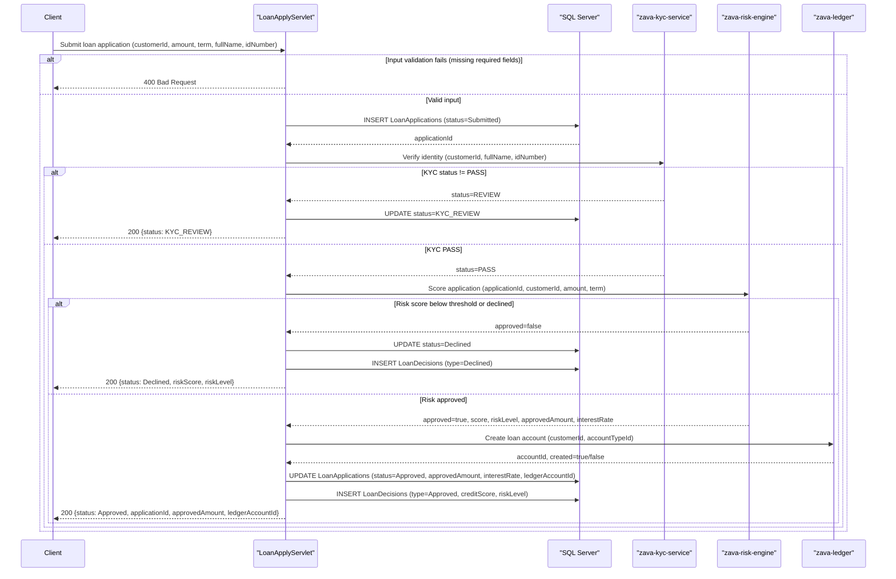

# Core Business Workflows

ZavaLoanOriginationAPI manages the end-to-end submission and decision process for retail loan applications, orchestrating identity verification, credit risk scoring, and ledger account creation across internal microservices.

## Domain Entities

| Entity | Service / Bounded Context | Description | Key Relationships |
|---|---|---|---|
| LoanApplication | Loan Origination | Represents a customer's request for a loan product, capturing amount, term, purpose, and the lifecycle status from submission to final decision | References Customer (external), LoanProduct (external), LoanDecision (1:many) |
| LoanDecision | Loan Origination | Records the outcome of a decision event on an application, including decision type, reason, credit score snapshot, and risk level at the time of decision | Belongs to LoanApplication (many:1) |
| Customer | Customer Domain (external) | A bank customer identified by integer ID; personal details (name, ID number) are provided in the loan application request and forwarded to the KYC service | Referenced by LoanApplication |
| LoanProduct | Product Catalog (external) | A loan product type referenced by integer ID; product rules (e.g., max amount, eligible terms) are not enforced by this service | Referenced by LoanApplication |
| LedgerAccount | Ledger Domain (zava-ledger) | A financial ledger account created when a loan is approved; the account ID is stored on the LoanApplication | Created by zava-ledger; ID stored in LoanApplication |

## Service-to-Domain Mapping

| Service | Domain Context | Owned Entities | External Dependencies |
|---|---|---|---|
| ZavaLoanOriginationAPI | Loan Origination | LoanApplication, LoanDecision | Customer identity (caller-supplied), LoanProduct (caller-supplied), zava-kyc-service (KYC), zava-risk-engine (credit scoring), zava-ledger (account creation) |
| zava-kyc-service | Identity / KYC | (not owned by this service) | Receives customerId, fullName, idNumber; returns pass/fail status |
| zava-risk-engine | Credit Risk | (not owned by this service) | Receives applicationId, customerId, requestedAmount, termMonths; returns score, riskLevel, approvedAmount, interestRate |
| zava-ledger | Ledger / Accounts | LedgerAccount | Receives customerId, accountTypeId; returns accountId |

## Primary Workflows

### Workflow 1: Loan Application Submission

The primary business workflow. A client submits a loan application request; the system validates inputs, persists the application, and sequentially orchestrates KYC verification, credit risk scoring, and ledger account creation before returning a final decision.

**Steps:**
1. **Input validation** — Mandatory fields (`customerId`, `loanProductId`, `requestedAmount`, `termMonths`) are verified. Missing or invalid values return an immediate 400 error; no record is created.
2. **Application creation** — The application is inserted into `LoanApplications` with status `Submitted`. A unique `applicationId` is generated.
3. **KYC gate** — A synchronous call is made to `zava-kyc-service /api/kyc/verify` with the customer's name and ID number. If the result is anything other than `PASS`, the application status is set to `KYC_REVIEW` and processing stops (no risk or ledger calls are made).
4. **Risk scoring** — A synchronous call is made to `zava-risk-engine /api/risk/score`. The engine returns a numeric score (0–999), a risk level, and an approval decision. If the engine declines (score < 620 or explicit `approved=false`), the application status is set to `Declined`.
5. **Ledger account creation** — If the risk engine approves, a synchronous call is made to `zava-ledger /api/accounts/create` to open a loan account. The returned `accountId` is stored on the application.
6. **Decision recording** — The application record is updated with the final status, approved amount, interest rate, and decision notes. A `LoanDecisions` row is inserted with the risk score, risk level, decision type, and reason.
7. **Response** — The composite result (status, applicationId, kycStatus, riskScore, approvedAmount, ledgerAccountId) is returned to the caller.

### Workflow 2: Loan Status Retrieval

A client queries the current state of an existing loan application by its ID. The servlet retrieves the application row from `LoanApplications` and returns a structured JSON response. No business logic or state mutation occurs.

### Workflow 3: Schema Bootstrap (Startup)

At container startup, `LoanBootstrapServlet` (load-on-startup=1) connects to SQL Server and creates the `LoanApplications` and `LoanDecisions` tables if they do not already exist. This is an idempotent DDL operation that must succeed before the application accepts traffic.

## Cross-Service Data Flows

The loan application orchestration is a **sequential synchronous pipeline** — not a parallel aggregation. Data flows through three downstream services in strict order, with each step's output gating the next:

1. **KYC input**: `customerId`, `fullName`, `idNumber` are taken verbatim from the inbound HTTP request body and forwarded to the KYC service. The KYC service returns a `status` string. No KYC data is persisted locally.
2. **Risk Engine input**: `applicationId` (just created), `customerId`, `requestedAmount`, and `termMonths` are sent. The risk engine returns `score`, `riskLevel`, `approved`, `approvedAmount`, and optionally `interestRate`. These values are stored on `LoanApplications` and `LoanDecisions`.
3. **Ledger input**: `customerId` and a `loanAccountTypeId` (from the request body, defaulting to `2`) are forwarded. The ledger returns `accountId` and `created`. The `accountId` is stored as `LoanAccountID` on the application.

**Fallback behavior**: There is **no circuit breaker or fallback** for any downstream call. If any service is unreachable or returns an unexpected response, the exception propagates and the caller receives a 500 error. The application record may be left in an intermediate state (e.g., `Submitted` if the failure occurs before the status update, or with a partial update if the failure occurs mid-transaction).

## Business Workflow Sequence



## Business Rules & Decision Logic

### Validation Rules

- `customerId` must be > 0 (integer); `loanProductId` must be > 0; `requestedAmount` must be > 0 (BigDecimal); `termMonths` must be > 0. All four are mandatory — any violation returns 400.
- `fullName` defaults to `"Customer {customerId}"` if omitted or blank.
- `purpose` is optional (NVARCHAR(500), nullable).
- Loan application ID in status queries must be a valid long integer extracted from the URL path segment matching `/api/loans/{id}/status`.

### Decision Logic & State Transitions

**Loan Application Status Lifecycle:**

```
Submitted → KYC_REVIEW          (KYC result != PASS)
Submitted → Declined            (KYC PASS, Risk score < 620 or risk engine declined)
Submitted → Approved            (KYC PASS, Risk approved, Ledger account created)
Submitted → APPROVED_PENDING_LEDGER  (KYC PASS, Risk approved, but Ledger creation failed)
```

- **KYC gate**: `kycStatus == "PASS"` (case-insensitive) is required to proceed past the KYC step.
- **Risk threshold**: Approval requires `riskScore >= 620` (when the risk engine does not supply an explicit `approved` field) or `approved == true` in the risk response.
- **Default interest rate**: `0.0725` (7.25%) is used if the risk engine does not return an `interestRate`.
- **Risk level classification** (client-side fallback when risk engine omits `riskLevel`): score ≥ 700 → `Low`; score ≥ 620 → `Medium`; score < 620 → `High`.

### Transaction Boundaries

- In `LoanApplyServlet`, the INSERT into `LoanApplications`, the subsequent UPDATE, and the INSERT into `LoanDecisions` are wrapped in a single manual JDBC transaction (`setAutoCommit(false)` / `commit()` / `rollback()`). The three downstream service calls (KYC, Risk, Ledger) occur **outside** the transaction; only the final DB writes are transactional.
- If a DB error occurs during the write phase, the transaction is rolled back and the caller receives a 500 error. The downstream service calls cannot be compensated (no saga/rollback mechanism).

### Error Handling

- SQL errors in `LoanApplyServlet` trigger a transaction rollback and return 500.
- Any exception from `HttpURLConnection` during downstream service calls is caught as a generic `Exception` returning a default `OrchestrationResult` with status `Submitted` and zeroed scores — **this silently suppresses downstream failures** rather than surfacing them as errors.
- `LoanStatusServlet` returns 404 when no matching application is found, and 500 on SQL errors.

### Authorization & Audit

- **No authentication or authorization** is enforced. Any caller can submit applications or query any application ID.
- No audit trail beyond the `LoanDecisions` table (which records the decision type, reason, and risk score at decision time). No change-log, soft-delete, or event sourcing is implemented.
