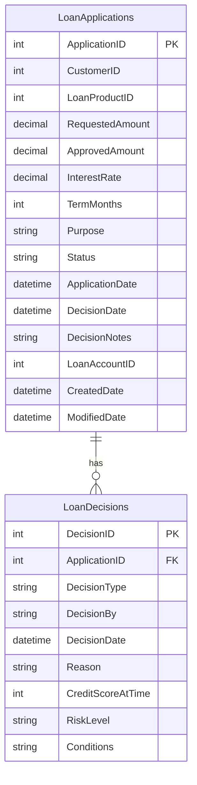

# Data Architecture & Persistence Layer

ZavaLoanOriginationAPI persists data in **two SQL Server tables** (`LoanApplications` and `LoanDecisions`) accessed exclusively through raw JDBC — no ORM framework is used.

## Database Configuration

| Service/Module | DB Type | Profile/Environment | Driver | Connection | Migration Tool |
|---|---|---|---|---|---|
| ZavaLoanOriginationAPI | Microsoft SQL Server | All (single config) | mssql-jdbc 12.6.3.jre11 | JDBC URL built from `db.host`, `db.port`, `db.name`; env vars override properties file | None — schema is created at startup via inline DDL in `LoanBootstrapServlet` |

Schema management is performed programmatically: `LoanBootstrapServlet` runs at container startup (`load-on-startup=1`) and executes `IF OBJECT_ID ... IS NULL CREATE TABLE` statements for both tables. There are no migration scripts, Flyway/Liquibase configurations, or versioned DDL files. See `configuration-inventory.md` for the full property inventory.

## Data Ownership per Service

| Service | Tables Owned | ORM Framework | Caching | Notes |
|---|---|---|---|---|
| ZavaLoanOriginationAPI | LoanApplications, LoanDecisions | None (raw JDBC via `DriverManager`) | None | Schema bootstrapped by `LoanBootstrapServlet` at startup; transactions managed manually via `connection.setAutoCommit(false)` and `connection.commit()`/`connection.rollback()` |

## Entity Model

> Note: `CustomerID`, `LoanProductID`, and `LoanAccountID` are foreign-key-like integer references to entities that reside in external services (customer service, product catalog, zava-ledger). They are stored as plain integers with no DB-level foreign key constraint.

## Key Repository Methods

There are no repository interfaces — all data access is performed via inline `PreparedStatement` calls within the servlet classes.

| Service | Access Point | SQL Operations | Purpose |
|---|---|---|---|
| LoanApplyServlet | Inline JDBC | `INSERT INTO LoanApplications` | Creates a new loan application record with status `Submitted` |
| LoanApplyServlet | Inline JDBC | `UPDATE LoanApplications SET Status, ApprovedAmount, InterestRate, DecisionDate, DecisionNotes, LoanAccountID` | Updates the application with the orchestration outcome after KYC/risk/ledger calls |
| LoanApplyServlet | Inline JDBC | `INSERT INTO LoanDecisions` | Records the decision details (type, reason, risk score, risk level) |
| LoanStatusServlet | Inline JDBC | `SELECT ApplicationID, CustomerID, Status, RequestedAmount, ApprovedAmount, InterestRate, TermMonths, DecisionDate, DecisionNotes, LoanAccountID FROM LoanApplications WHERE ApplicationID = ?` | Retrieves application status by primary key |
| LoanBootstrapServlet | Inline JDBC | `IF OBJECT_ID IS NULL CREATE TABLE LoanApplications; IF OBJECT_ID IS NULL CREATE TABLE LoanDecisions` | Idempotent schema bootstrap at application startup |

All statements use `PreparedStatement` with positional parameters. Transaction boundaries are managed manually in `LoanApplyServlet`: `connection.setAutoCommit(false)` before the insert/update/insert sequence, `connection.commit()` on success, and `connection.rollback()` on `SQLException`.

## Caching Strategy

No caching layer is present. Every request opens a new JDBC connection via `DriverManager.getConnection()` and queries the database directly. There is no second-level cache, query result cache, application-level cache (EhCache, Redis, Caffeine), or Spring Cache abstraction. Connection pooling (HikariCP, DBCP) is also absent — each request creates and closes its own TCP connection to SQL Server.

## Data Ownership Boundaries

The application uses a **single shared SQL Server database** (`ZavaBankDB`). Both tables (`LoanApplications`, `LoanDecisions`) are owned entirely by `ZavaLoanOriginationAPI`. There is no database-per-service or schema-per-service isolation.

Cross-service data references are handled via plain integer ID columns without referential integrity enforcement at the database level:
- `CustomerID` references a customer record owned by an external customer service.
- `LoanProductID` references a product record owned by an external product catalog.
- `LoanAccountID` references a ledger account created by `zava-ledger` and stored as an opaque integer.

No CQRS pattern is implemented. All reads and writes go through the same SQL Server instance using the same JDBC connection string.

### Data Classification & Sensitivity

| Entity | Sensitive Fields | Classification | Controls in Place |
|---|---|---|---|
| LoanApplications | `CustomerID` (identity reference), `RequestedAmount`, `ApprovedAmount`, `Purpose`, `DecisionNotes` | PII-adjacent / Financial | None — data is stored in plaintext; no encryption-at-rest, field-level masking, or access control configured at the application layer |
| LoanDecisions | `DecisionBy`, `Reason`, `CreditScoreAtTime`, `Conditions` | Financial / Sensitive | None — stored in plaintext with no masking or access controls |

The KYC payload (`fullName`, `idNumber`) is passed from the HTTP request body directly to the KYC service over plain HTTP and is **never persisted locally** — however, it is transmitted without TLS, which represents a data-in-transit risk. The `db.password` is stored in plaintext in `loan-origination.properties` and referenced directly from `LoanOriginationConfig`.
