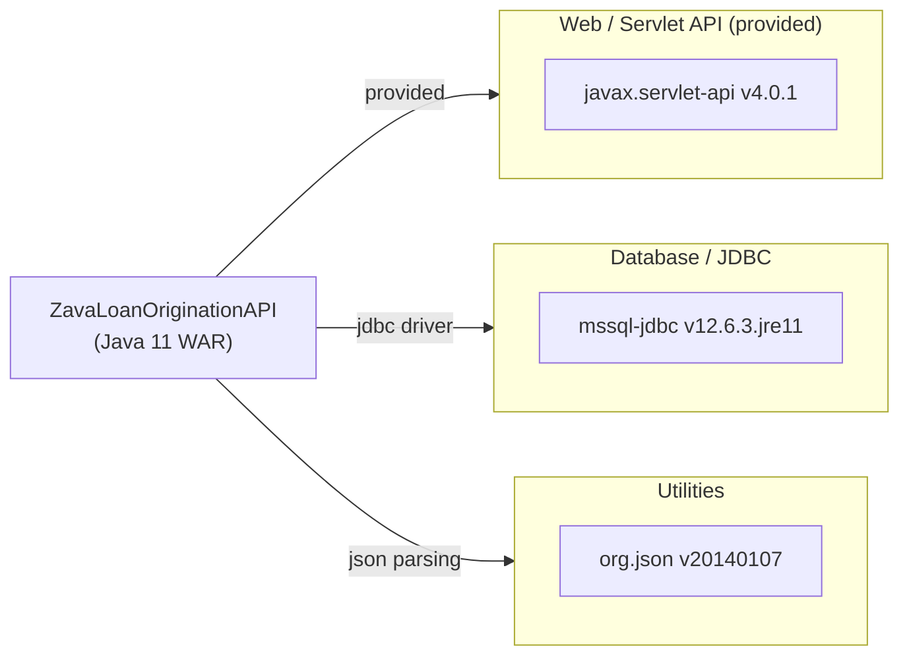

# Dependency Map

ZavaLoanOriginationAPI declares **3 external dependencies** — a minimal set consisting of a servlet API, a SQL Server JDBC driver, and a JSON utility library.

## Dependencies

### Dependency Summary

| Category | Count | Key Libraries | Notes |
|---|---|---|---|
| Web / Servlet API | 1 | javax.servlet-api 4.0.1 | `compileOnly` — provided by the servlet container at runtime |
| Database / JDBC | 1 | mssql-jdbc 12.6.3.jre11 | Official Microsoft JDBC driver for SQL Server, JRE 11 variant |
| Utilities | 1 | org.json 20140107 | Minimal JSON library, year-2014 release |

### Version & Compatibility Risks

The most significant risk is `org.json:json:20140107`, a version frozen at a 2014 release. This artifact predates the JSON standard's formal consolidation and lacks many modern conveniences; it has also had known CVEs in older releases. `javax.servlet-api:4.0.1` uses the legacy `javax.*` namespace, which was superseded by `jakarta.*` in Jakarta EE 9+; migrating to a modern servlet container (Tomcat 10+, JBoss EAP 8) will require namespace migration. `mssql-jdbc:12.6.3.jre11` is a recent release and carries no immediate compatibility concern.

### Notable Observations

- **No logging framework declared**: The application does not declare SLF4J, Logback, Log4j, or any other logging library, relying entirely on `System.out`/`System.err` or the container's default logging.
- **No connection pool declared**: Database connections are opened via raw `DriverManager.getConnection()` — there is no HikariCP, DBCP, or c3p0, meaning each request creates a new TCP connection to SQL Server.
- **Extremely lean dependency tree**: With only 3 declared dependencies the transitive risk surface is very small, but the trade-off is that many capabilities (connection pooling, HTTP client, retry/resilience, config management) are implemented by hand.
- **`org.json` version is very outdated**: The `20140107` build stamp indicates a 2014 artifact. Modern alternatives such as Jackson or Gson offer better performance, active maintenance, and security patches.

## Test Dependencies

No test-scoped dependencies detected in `build.gradle`.

Total test-scope dependencies: **0**

No test framework (JUnit, TestNG, Mockito, etc.) is declared. The project currently has no automated test coverage, which represents a risk for refactoring or cloud migration activities.
