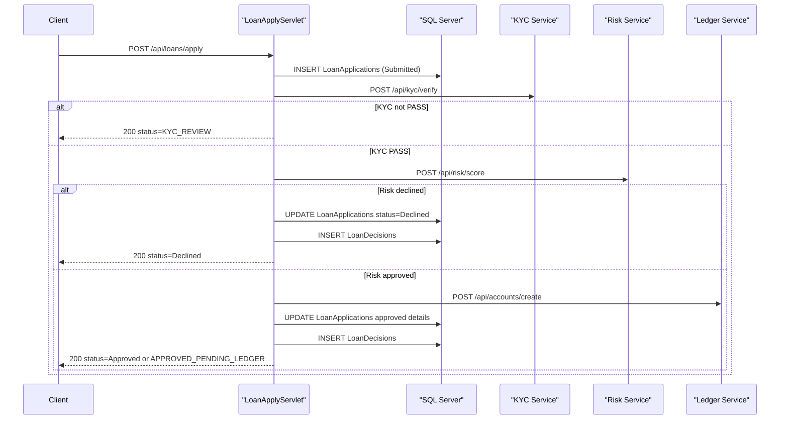

# API & Service Communication Contracts

This project exposes a small synchronous HTTP API surface with loan submission and status retrieval flows and direct outbound REST-style calls to downstream services.

## Service Catalog

| Service | Port | Category | Purpose |
|---|---:|---|---|
| ZavaLoanOriginationAPI | 8080 | Business | Accept loan applications, orchestrate checks, persist and return status |
| Zava KYC Service (external) | 8080 | Infrastructure | Verifies customer identity for loan processing |
| Zava Risk Engine (external) | 8080 | Infrastructure | Produces approval and risk scoring decision |
| Zava Ledger Service (external) | 8080 | Infrastructure | Creates loan account in ledger |

## API Endpoints Inventory

| Service | Method | Path | Request Type | Response Type |
|---|---|---|---|---|
| ZavaLoanOriginationAPI | POST | /api/loans/apply | JSON body (`customerId`, `loanProductId`, `requestedAmount`, `termMonths`, etc.) | JSON status payload with orchestration output |
| ZavaLoanOriginationAPI | GET | /api/loans/{id}/status | Path parameter (`id`) | JSON status/details or error payload |
| ZavaLoanOriginationAPI | GET | /health | None | HTML health message |
| ZavaLoanOriginationAPI | (startup) | /internal/bootstrap | Servlet init lifecycle | Table bootstrap side effect |

## Management & Observability Endpoints

| Service | Endpoint | Custom Metrics (if any) |
|---|---|---|
| ZavaLoanOriginationAPI | /health | None detected |

## DTOs & Contracts

The API contracts are dynamic JSON payloads handled through `org.json.JSONObject` rather than typed DTO classes. Contract roles are:
- Loan apply request payload: parsed from request body and consumed by `LoanApplyServlet#doPost`
- Loan apply response payload: composed from `OrchestrationResult` fields and returned as JSON
- Loan status response payload: populated from SQL query result columns and returned as JSON
- Downstream service request/response payloads: JSON documents exchanged with KYC, risk, and ledger APIs

No OpenAPI, protobuf, or GraphQL schema files were detected.

## Communication Patterns

Communication is synchronous HTTP over `HttpURLConnection` for all downstream integrations in the apply workflow. Persistence is synchronous JDBC with transactional scope around insert/update operations in `LoanApplyServlet`. The workflow includes decision-based branching (KYC review, risk decline, ledger pending). Service discovery is static via configured base URLs; no gateway/discovery framework is present. Retry/circuit-breaker libraries are not configured. API-level authentication/authorization and TLS enforcement are not implemented in this codebase; configured service URLs use plain HTTP.

## Service Technology Matrix

| Service | Web | Data Access | Discovery | Gateway | Actuator | Cache | Metrics |
|---|---|---|---|---|---|---|---|
| ZavaLoanOriginationAPI | Servlet API | JDBC | None | None | Basic /health servlet | None | None |

## Service Communication Sequence

