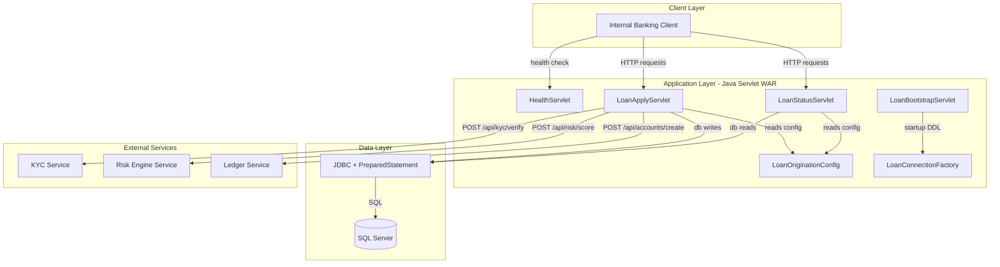
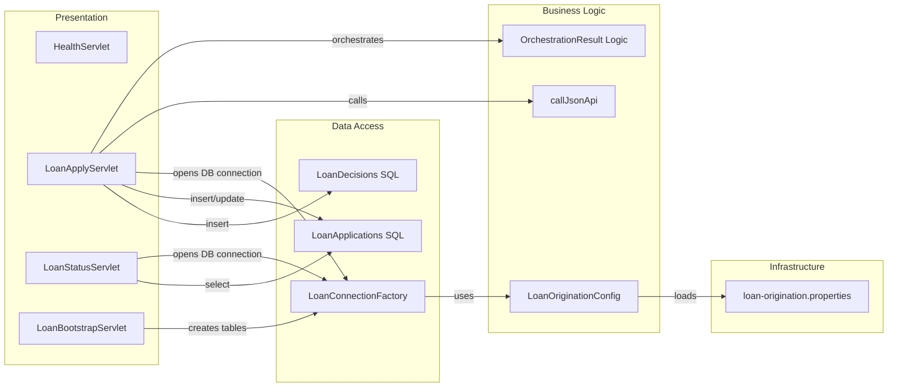

# Architecture Diagram

This diagram summarizes the servlet-based loan origination API and its key runtime components.

## Application Architecture

### Technology Stack Summary

| Layer | Technology | Version | Purpose |
|---|---|---|---|
| Presentation | Javax Servlet API | 4.0.1 | HTTP endpoint handling |
| Business | Java application logic | Java 11 target | Loan orchestration and decision flow |
| Data Access | JDBC + SQL Server driver | mssql-jdbc 12.6.3.jre11 | Persist and query loan records |
| Serialization | org.json | 20140107 | Parse request payloads and produce JSON responses |

### Data Storage & External Services

The service stores loan applications and decision records in SQL Server tables (`LoanApplications`, `LoanDecisions`) and calls three downstream HTTP services for KYC verification, risk scoring, and ledger account creation.

### Key Architectural Decisions

- Uses synchronous orchestration in `LoanApplyServlet` to chain KYC, risk, and ledger calls in one request lifecycle.
- Uses JDBC prepared statements for CRUD-style database access without an ORM layer.
- Bootstraps schema at startup using `LoanBootstrapServlet`.

## Component Relationships

### Component Inventory

| Component | Layer | Type | Responsibility |
|---|---|---|---|
| LoanApplyServlet | Presentation | Servlet | Accepts loan applications and orchestrates downstream decisions |
| LoanStatusServlet | Presentation | Servlet | Returns loan status and decision details by application id |
| LoanBootstrapServlet | Presentation | Servlet (startup) | Creates required database tables during initialization |
| HealthServlet | Presentation | Servlet | Returns basic health response |
| LoanOriginationConfig | Business Logic | Configuration utility | Resolves config values from env vars and properties |
| LoanConnectionFactory | Data Access | Connection factory | Creates SQL Server JDBC connections |
