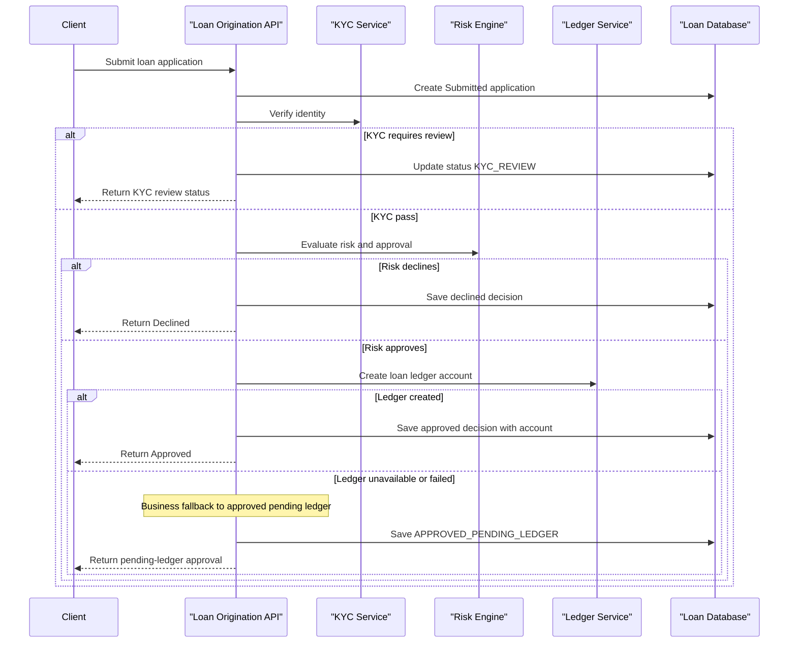

# Core Business Workflows

This application supports loan origination by receiving customer loan requests, orchestrating credit decision steps, and exposing current loan status for follow-up.

## Domain Entities

| Entity | Service / Bounded Context | Description | Key Relationships |
|---|---|---|---|
| Loan Application | Loan Origination | Represents a submitted customer request for a loan product | Produces one or more decision entries |
| Loan Decision | Loan Origination | Captures decision outcome and rationale over time | Linked to one loan application |
| KYC Result | External KYC | Identity verification outcome used in approval path | Influences loan application status |
| Risk Decision | External Risk Engine | Score/risk evaluation used to approve or decline | Influences approval and pricing |
| Ledger Account | External Ledger | Account creation result for approved loans | Associated to approved application |

## Service-to-Domain Mapping

| Service | Domain Context | Owned Entities | External Dependencies |
|---|---|---|---|
| ZavaLoanOriginationAPI | Loan Origination | Loan Application, Loan Decision | KYC service, Risk service, Ledger service, SQL Server |
| Zava KYC Service | Identity Verification | KYC Result | Called by loan origination |
| Zava Risk Engine | Credit Risk | Risk Decision | Called by loan origination |
| Zava Ledger Service | Loan Accounting | Ledger Account | Called by loan origination |

## Primary Workflows

### Workflow 1: Submit Loan Application

1. Client submits `POST /api/loans/apply` with customer and loan details.
2. Service validates required numeric fields and parses request JSON.
3. Service creates an initial loan application record (`Submitted`).
4. Service calls KYC; if not pass, workflow exits with `KYC_REVIEW`.
5. On KYC pass, service calls risk engine; if declined, marks application declined.
6. On approval, service calls ledger account creation and stores account linkage if successful.
7. Service updates application status/details and writes a decision record.
8. Response returns final status and orchestration outputs.

### Workflow 2: Check Loan Status

1. Client requests `GET /api/loans/{id}/status`.
2. Service validates path format and numeric id.
3. Service reads application row by id and returns current status payload.

## Cross-Service Data Flows

Loan submission composes three dependent service calls: identity verification from KYC, credit assessment from risk engine, and account creation from ledger. Data is joined in-memory in the orchestration result object and persisted back into local loan tables. If KYC fails, risk and ledger calls are skipped; if risk declines, ledger call is skipped; if ledger creation fails, response degrades to `APPROVED_PENDING_LEDGER` while preserving approved decision state.

## Business Workflow Sequence

## Business Rules & Decision Logic

- Required inputs for submission: `customerId`, `loanProductId`, `requestedAmount`, and `termMonths` must be valid positive values.
- KYC gate: any non-PASS KYC response routes to manual review status.
- Risk gate: approved flag (or score threshold fallback) determines approve/decline branch.
- Decision persistence: every terminal branch stores decision context in `LoanDecisions`.
- Transactional handling: DB insert/update steps are wrapped in one transaction with rollback on SQL exceptions.
