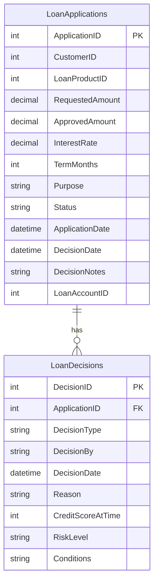

# Data Architecture & Persistence Layer

The data layer uses direct JDBC access against SQL Server with two primary tables and no ORM abstractions.

## Database Configuration

| Service/Module | DB Type | Profile | Driver | Connection | Migration Tool |
|---|---|---|---|---|---|
| ZavaLoanOriginationAPI | SQL Server | Default (properties/env) | com.microsoft.sqlserver:mssql-jdbc | JDBC URL built from host/port/name with user/password | Startup DDL in `LoanBootstrapServlet` |

## Data Ownership per Service

| Service | Tables Owned | ORM Framework | Caching | Notes |
|---|---|---|---|---|
| ZavaLoanOriginationAPI | LoanApplications, LoanDecisions | None (plain JDBC) | None | Creates tables on startup if absent |

## Entity Model

## Key Repository Methods

| Service | Repository | Notable Methods | Purpose |
|---|---|---|---|
| ZavaLoanOriginationAPI | LoanApplyServlet (JDBC methods) | `insertApplication`, `updateApplication`, `insertDecision` | Persist application lifecycle and decision outcomes |
| ZavaLoanOriginationAPI | LoanStatusServlet (JDBC query) | `doGet` query by `ApplicationID` | Retrieve current application status and details |
| ZavaLoanOriginationAPI | LoanBootstrapServlet (DDL) | `init` table creation statements | Initialize schema at startup |

## Caching Strategy

No application-level cache provider or cache annotations were detected. All reads/writes go directly to SQL Server and external services.

## Data Ownership Boundaries

Data storage is centralized in a single SQL Server schema owned by the same service. Cross-service access for KYC/risk/ledger data occurs over HTTP calls; external services are not accessed through shared database queries. Read and write responsibilities for loan data remain inside this service.

### Data Classification & Sensitivity

| Entity | Sensitive Fields | Classification (PII/PHI/PCI/None) | Controls in Place |
|---|---|---|---|
| LoanApplications | CustomerID, Purpose, DecisionNotes | PII | No masking or field-level access controls detected in code |
| LoanDecisions | Reason, DecisionBy | PII | No masking or field-level access controls detected in code |
