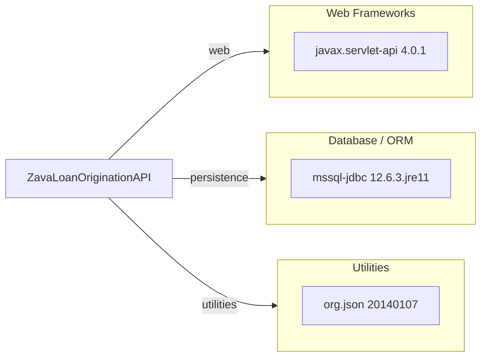

# Dependency Map

This dependency map summarizes the declared Gradle dependencies for ZavaLoanOriginationAPI (3 total declared dependencies).

## Dependencies

### Dependency Summary

| Category | Count | Key Libraries | Notes |
|---|---:|---|---|
| Web Frameworks | 1 | javax.servlet-api | Provided by servlet container at runtime |
| Database / ORM | 1 | mssql-jdbc | Direct SQL Server connectivity via JDBC |
| Utilities | 1 | org.json | JSON parsing and serialization utility |

### Version & Compatibility Risks

`org.json:json:20140107` is very old and has known high-severity advisories. `mssql-jdbc:12.6.3.jre11` has a newer patch release available for a high-severity advisory.

### Notable Observations

- No explicit logging framework dependency is declared.
- No security/authn/authz dependency is declared in build metadata.
- Dependency set is minimal and centered on servlet + JDBC primitives.

## Test Dependencies

No test dependencies detected.

Total test-scope dependencies: 0
No test-specific dependency declarations are present in `build.gradle`.
